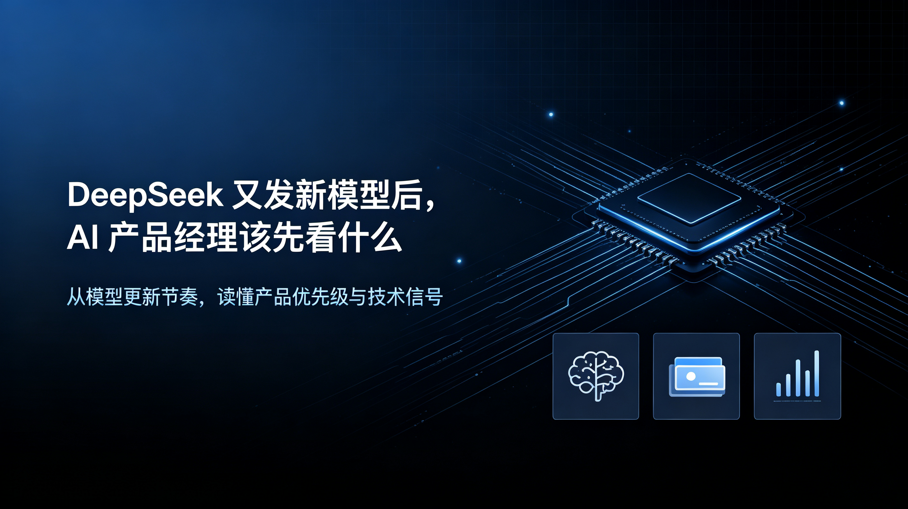
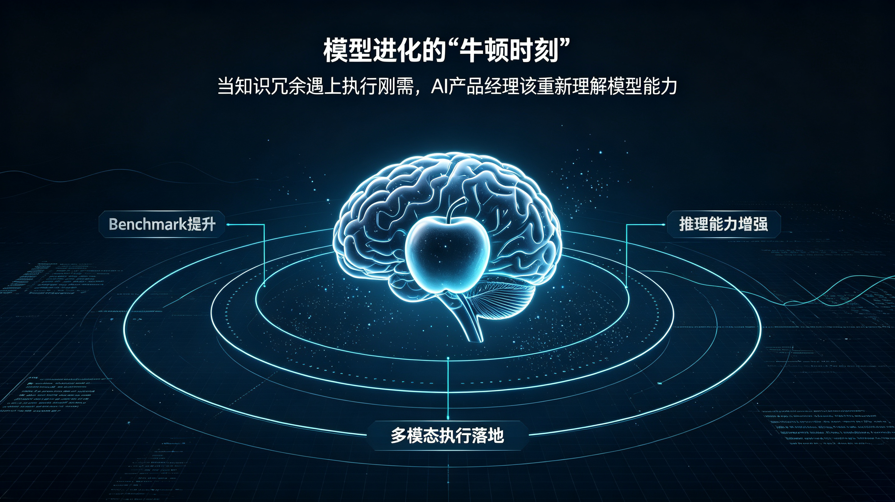
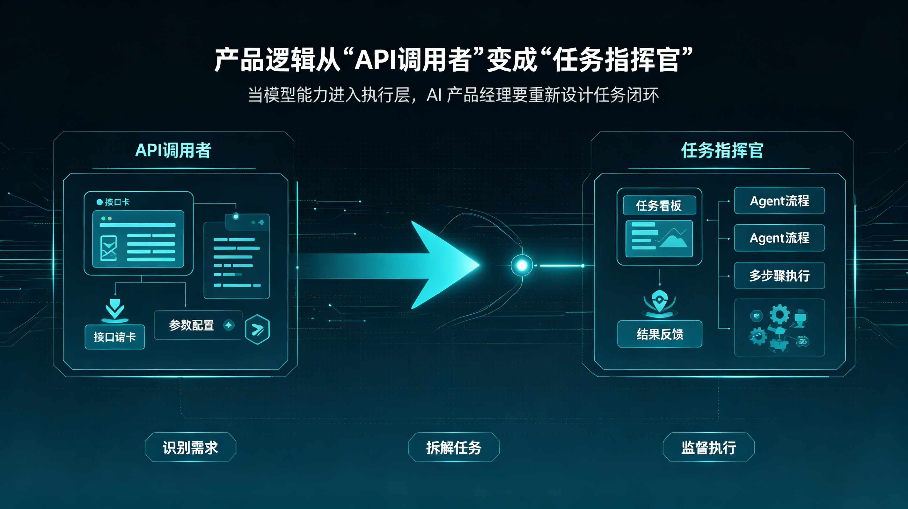
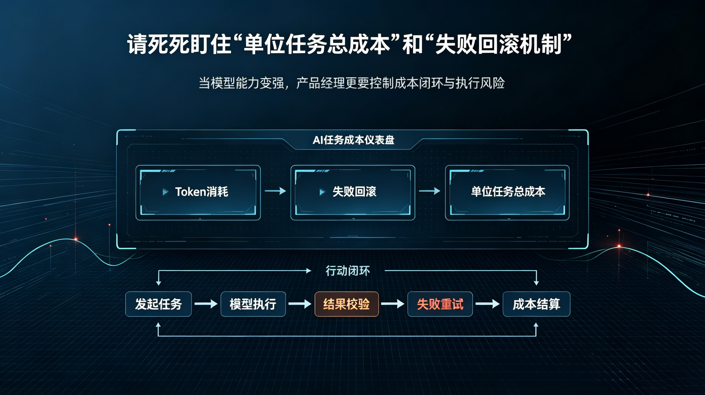

# DeepSeek 又发新模型后，AI 产品经理该先看什么

2026年8月，DeepSeek 的更新节奏快到让人眼花缭乱。

7月31日，DeepSeek-V4-Flash正式版上线，Agent能力大幅增强，基准测试得分远超预览版。8月13日凌晨，V4-Pro正式版悄然发布，API文档无声刷新——1.6T总参数、49B激活参数的MoE架构没变，但Agent相关评测分数暴涨：DeepSWE从预览版的12.8飙到62.7。同一天，DeepSeek Harness开发者预览版对外开放，以MIT协议开源。8月21日，多模态视觉理解模型V4-Flash-Vision-Exp上线API平台，多模态Agent能力接近Opus 4.8。不到三周，Flash正式版、Pro正式版、Harness框架、多模态模型——四连发。

密集发布本身并不稀奇，真正值得AI产品经理关注的，是这轮发布背后透露出的三个信号。

信号一：模型能力的竞争维度正在迁移。

过去一年，AI产品经理最熟悉的动作是盯着Benchmark榜单——MMLU提了几分、HumanEval排第几。但DeepSeek这轮更新的核心指标变了：Agent Last Exam、Automation Bench Public、DeepSWE、Terminal Bench、Cybergym。这些评测的共同特征是——它们考察的不是“模型知道什么”，而是“模型能做什么”。代码仓库理解与修改、终端操作、网络安全任务、全栈开发测试——每一项都指向真实工作场景中的长链路执行能力。

对于产品经理而言，这意味着评估模型的坐标系需要重置。过去的问题是“这个模型能不能回答用户的问题”，现在的问题是“这个模型能不能替用户完成一项任务”。前者衡量的是知识密度，后者衡量的是执行可靠性——而后者恰恰是决定产品用户体验的关键变量。

信号二：竞争从“模型能力”延伸到“Agent基础设施”。

V4-Pro发布当天，DeepSeek同步推出了Harness——一套开源的Agent开发框架。单独看V4-Pro，是一次模型升级；单独看Harness，是一个开发工具。但放在一起看，指向很清楚：DeepSeek正在把模型、Agent Runtime与规模化服务放进同一套技术版图。V4-Pro负责提供更强的推理、编程和工具使用能力；Harness负责把模型接入工具、会话、文件系统、沙箱与执行循环。

这个布局对AI产品经理的启示是：未来的AI产品竞争，不再只看“用谁的模型”，而是看“在谁的框架上构建Agent”。模型会越来越同质化，但Agent的执行环境、工具生态、插件体系会成为新的差异化壁垒。Harness的模块化设计和插件机制，意味着开发者可以按场景替换和重组组件——这对产品经理来说，既是机会也是挑战：机会在于可以更灵活地定制产品形态，挑战在于需要重新思考产品的技术架构选型。

信号三：成本结构正在改变产品逻辑。

8月17日起，DeepSeek API实施峰谷定价。与此同时，V4-Pro在百万Token场景下的单Token推理FLOPs约为V3.2的27%，KV Cache约为后者的10%。效率提升和定价调整同时发生，指向一个趋势：当Agent开始持续运行、多轮交互、长上下文处理成为常态，模型厂商必须重新思考计算资源的调度方式，企业也要重新理解一次任务的真实成本。

这对产品经理意味着什么？过去做AI产品，成本结构相对简单——按Token计费，按调用量预估。但当Agent执行一个任务可能涉及数十次乃至上百次模型调用、大量上下文读写时，成本模型变得复杂得多。产品经理需要重新审视：哪些场景值得用Agent方案，哪些场景用传统方案更经济；用户体验的“流畅感”和背后的算力成本之间如何平衡；峰谷定价下，产品的调用策略如何设计。

所以，该先看什么？

不是看模型又多了多少参数——参数规模早在预览版就已确定。也不是逐行对比Benchmark分数的变化——那些数字更多是技术团队的关注范畴。

真正该先看的，是模型能力边界的变化如何重新定义你的产品能做什么——V4-Pro的Agent能力跃升，是否意味着之前不敢做的自动化场景现在可以落地了？多模态能力的加入，是否打开了新的交互形态和产品形态？

真正该先看的，是Agent基础设施的完善如何改变你的产品架构——Harness的开源和插件机制，是否意味着你可以用更低的成本构建复杂的Agent工作流？是否应该从现在开始把“Agent可组合性”纳入产品设计原则？

真正该先看的，是成本结构的变化如何影响你的商业模型——当模型调用成本下降但任务复杂度上升，你的产品定价、免费额度、付费转化策略是否需要调整？

DeepSeek的这轮密集发布，本质上是把AI产品经理的注意力从“模型层”拉到了“产品层”——从关心模型能干什么，到关心产品能用模型干什么、怎么干、花多少钱干。这恰恰是产品经理最该站的位置。

那么，放眼望去，具体该看什么、怎么看？我将从底层逻辑（原因）、产品形态（结果）和落地动作（建议）三个层面，拆解这场发布带来的真实风向。

### 模型进化的“牛顿时刻”——当知识冗余遇上执行刚需

过去一年，大部分AI产品经理习惯了把模型当作“超级百科”：用户问，模型答，答案对不对看Benchmark。但在V4-Pro的更新日志中，一个数字格外刺眼——DeepSWE从预览版的12.8飙升至62.7。DeepSWE考察的不是模型会不会写一个冒泡排序，而是模型能否像一个刚入职的初级工程师那样，理解整个代码仓库的结构、定位某个历史遗留Bug的上下文、自主分叉并修改代码、最后运行单元测试并根据报错结果自我修正。这不再是“选择题考试”，而是“实习期考核”。

为什么DeepSeek要在短短三周内连续押注Agent评测集？因为传统的Scaling Law（缩放法则）在知识记忆层面正在撞墙。MMLU、HumanEval这些静态数据集的得分已趋于饱和，堆再多的参数，用户也感受不到“更聪明”，只感受到“更贵”。大模型厂商终于意识到，推理（Reasoning）和执行（Execution）才是新的增长飞轮。DeepSeek将海量算力从“预训练知识填充”抽离出来，投入到“后训练强化学习执行轨迹”中——用强化学习去训练模型在真实环境（终端、沙箱、代码库）中的试错与纠偏能力。这一转变的根本原因，是市场付费意愿的转移：企业不再愿意为“华丽的废话”买单，而愿意为“确定性的任务完成”付费。

这个原因直接倒逼产品经理重新定义产品的核心价值。以往你的产品卖点是“接入最聪明的模型”，现在这个卖点失效了。因为模型聪明与否的衡量标准变了——你的产品必须从“答案引擎”进化为“行动引擎”。如果你还在比对V4-Pro比上一代多考了几分，而竞争对手已经在设计“自动修复线上小Bug”的Agent工作流，那么三个月后，用户会认为你的产品是上个时代的古董。根本原因不在于算力大小，而在于技术路线对产品形态的重构。

### 产品逻辑从“API调用者”变成“任务指挥官”

8月21日多模态模型V4-Flash-Vision-Exp上线时，很多产品经理的第一反应是“又多了一个识图接口”。但真正值得玩味的，是同步推出的DeepSeek Harness开源框架。假设你正在做一个面向电商运营的AI工具，以前的做法是：用户上传一张海报图，模型识别文案，输出修改建议。这是线性调用。而在Harness的框架下，你可以搭建一个Agent团队——视觉Agent识别图片元素，推理Agent分析用户画像，代码Agent自动修改PSD文件中的图层文字，最后验证Agent检查修改后的分辨率并直接推送至发布后台。整个流程不再是“一问一答”，而是“一次指令，全链自治”。

为什么Harness和Vision模型要捆绑发布？因为DeepSeek在暗示：单独的模型能力（哪怕带视觉）只是孤立的“肌肉”，Harness才是连接肌肉的“神经系统”。AI产品的技术架构正在发生质变：从单次API调用，变为包含规划（Planning）、工具调用（Tool Use）、状态记忆（Memory）和反思循环（Reflection）的Agent闭环。这对产品经理最大的冲击在于，产品的交互形态被彻底打破了。过去我们设计的是对话框、按钮和表单；未来我们设计的是目标设定面板、执行进度条、中间产物沙箱和异常干预入口。用户不再需要关心“提示词怎么写”，只需要告诉AI“我要什么结果”。

这种产品逻辑的重构，带来了两个直接后果。第一，产品的失败率变高了，但容错设计变得至关重要——因为Agent执行长链路任务时，任何一个环节的偏差都可能导致最终结果崩盘，产品经理必须优先设计“执行过程可视化”和“人工兜底介入点”，而不是追求一次性成功率。第二，产品的竞争壁垒从“模型选型”迁移到了“流程编排能力”——Harness虽然是开源的，但每个产品基于自身业务场景编排出的专属插件库、工具链和执行策略，才是竞品无法轻易复制的护城河。结果是，AI产品经理必须像当年移动互联网时代的产品经理研究iOS/Android系统特性一样，去深入研究Agent框架的调度逻辑和工具生态接口。

### 请死死盯住“单位任务总成本”和“失败回滚机制”

8月17日的峰谷定价和效率数据释放了一个极具迷惑性的信号：V4-Pro的单Token推理FLOPs仅为V3.2的27%，KV Cache仅为后者的10%。表面上看，成本在大幅下降，产品经理可以松一口气了。但请做一个简单的测算：假设你做一个“自动整理季度财报并生成PPT”的Agent，它可能需要先调用搜索工具抓取数据（3次模型调用），再编写Python清洗异常值（5次试错循环），再生成可视化图表（2次调用），最后排版PPT（3次调用）。即便单次调用成本降低了70%，但如果Agent的循环次数因为任务复杂度从2次增加到20次，你的单位任务总成本可能不降反升。峰谷定价机制更意味着，如果所有用户都在白天高峰期发起长任务，你的月度API账单可能会失控。

这里隐藏着一个产品经理极易掉入的陷阱：用“单次Token成本”来推算“整体商业模型”是危险的。当Agent成为主流交互模式后，成本结构从“线性计价”变成了“指数/循环计价”。模型越强大，它就越倾向于“多想几步”，而每一步都在消耗真金白银。同时，由于长链路Agent存在“垃圾进、垃圾出”的累积误差风险，一旦某个子任务失败，系统如果缺乏智能的回滚（Rollback）和重试（Retry）策略，就会陷入无限死循环，导致成本黑洞。因此，产品经理必须从“关注模型能力上限”转向“关注任务完成率的下限和成本的上限”。

基于此，我给AI产品经理三句落地的硬建议：第一，立刻建立“任务级成本看板”，不要只看总Token消耗，要拆解出每个用户主任务的平均完成成本、失败重试消耗占比和闲置循环浪费；第二，将“失败降级体验”写入PRD，当Agent连续两次执行失败时，是静默重试，还是主动向用户请求补充信息，或是直接转接人工客服——这不再是技术问题，而是产品体验的核心断点；第三，利用峰谷定价设计“延迟特权”，将用户非紧急的批量任务（如日报生成、周报汇总）自动路由到低谷时段处理，既节省成本，又能以“专属夜间整理”为卖点提升会员转化率。结果就是，未来的AI产品经理不仅要懂用户心理和交互设计，还要算得清一笔“执行账”——因为你省下来的每一分算力成本，都可能转化为产品定价权的优势。

回顾这三周的四连发，DeepSeek给AI产品经理上的最深刻一课是：模型的终局不是更聪明的答题者，而是更可靠的执行者。

原因很简单——知识问答的竞赛已近尾声，真正的增量空间在于用长链路Agent替代人类完成完整任务流程。结果也很清晰——产品形态将从单次调用的“工具”进化为统筹全局的“指挥官”，交互设计、架构选型和容错机制全部面临重构。而最迫切的建议，则是把注意力从Benchmark分数转移到“单位任务总成本”和“失败回滚策略”上，因为算力消耗正在从固定成本变成可变风险。

这轮发布之所以值得产品经理高度关注，不是因为它刷新了某个榜单的排名，而是它刷新了AI产品从0到1的起点和从1到N的约束条件。模型能力的跃迁、Agent框架的开源、多模态的嵌入、峰谷定价的引入——四个看似独立的更新，共同指向一个清晰的信号：AI产品经理的黄金时代不是结束了，而是刚刚换了一张考卷。

过去，你只需要回答“用户问什么”；未来，你要回答“产品能替用户完成什么、怎么完成、花多少成本完成”。这张考卷更难，但答案的边界也更大。那些率先完成视角切换的产品经理，将会在下一波浪潮中定义规则，而不只是适应规则。

把目光从模型的参数上移开，转向任务的终点线——那里才是真正的产品战场。
